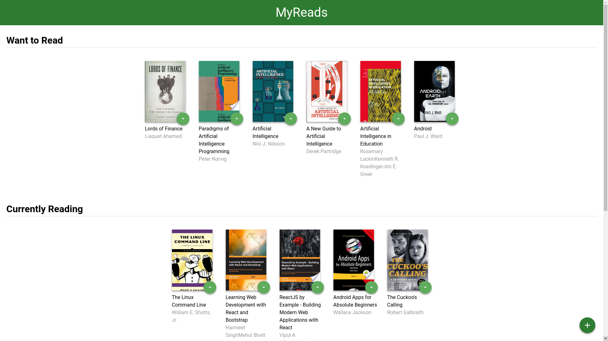

  

# Project Overview

This is my submission for [Udacity's Front-End Web Developer Nanodegree](https://www.udacity.com/course/front-end-web-developer-nanodegree--nd001). The project is a web-based application built on React. The web application allows the user to select and categorize books she/he has read, is currently reading, or want to read.

## How to run.
1. Download or clone the project from repository.

2. Download and install [Node.js](https://nodejs.org/en/download/) (if you do not have it already installed).

3. Navigate to the folder where project is located using **terminal** or **CMD**.

4. Install all project dependencies with `npm install` command.

5. Start the development server with `npm start` command,

6. In your browser go to: [http://localhost:3000/](ttp://localhost:3000/).

## REQUIREMENTS

- `Node.js`
- Browser with JavaScript enabled (by default it is enabled on all browsers).

#### License
The content of this repository is licensed under a [Creative Commons Attribution License](https://choosealicense.com/licenses/mit/).
